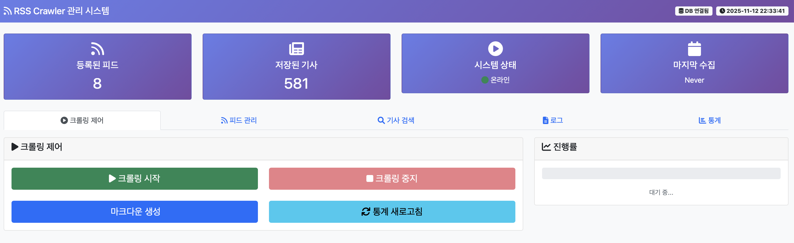
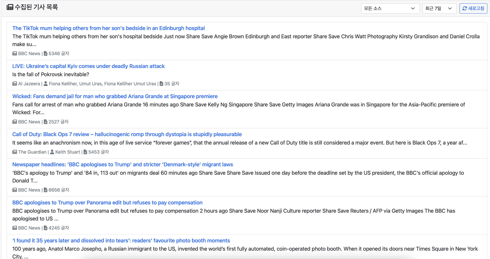
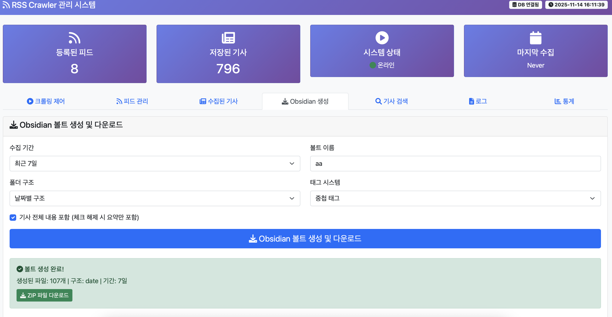
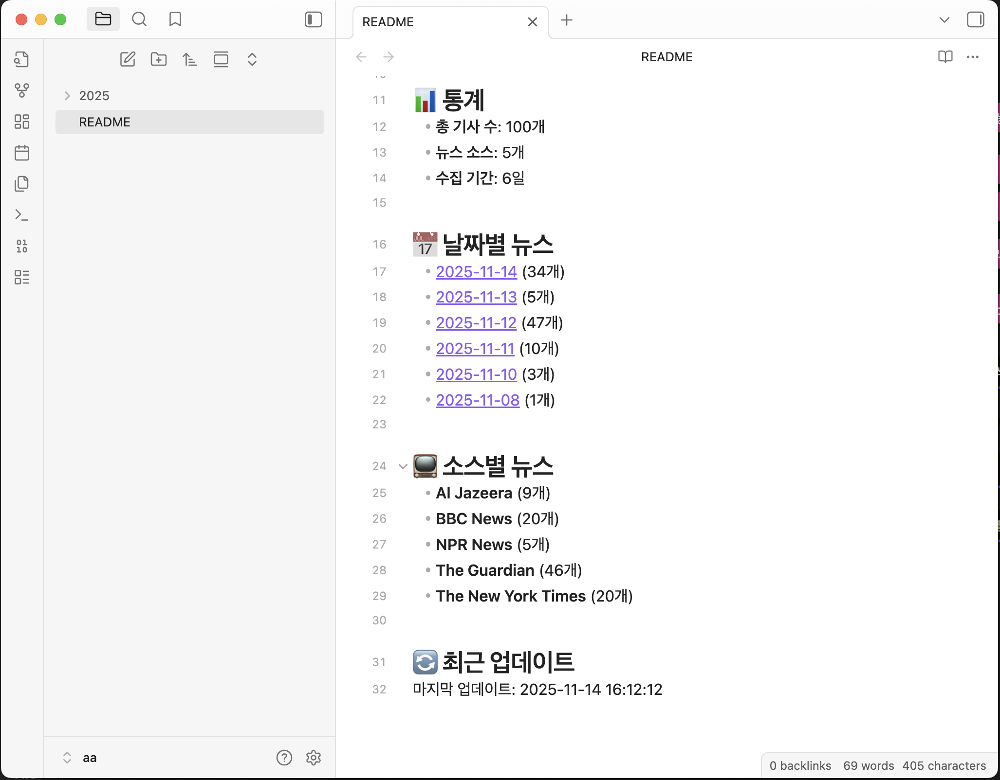
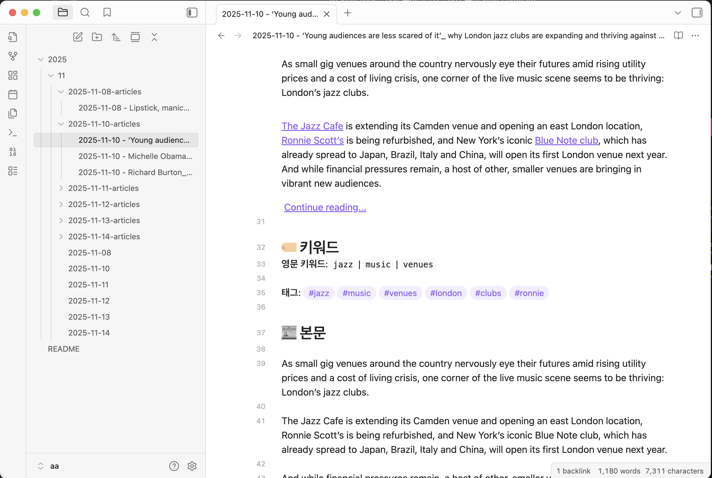

# 🚀 AI-RSSCrawler

**AI-powered RSS News Crawling & Obsidian Markdown Generation System**  
**AI 기반 RSS 뉴스 크롤링 및 Obsidian 마크다운 생성 시스템**

[](https://python.org)
[](LICENSE)
[](#)

## 🎯 Project Background & Purpose / 프로젝트 배경 및 목적

AI-RSSCrawler is a project started in **August 2024** to efficiently collect and analyze stock-related news.

**AI-RSSCrawler**는 **2024년 8월**에 시작된 프로젝트로, 주식 관련 뉴스를 효율적으로 수집하고 분석하기 위해 개발되었습니다.

### 📊 **Original Goals / 원래 목표**
- **Stock News Collection / 주식 뉴스 수집**: Automatically collect stock-related information from various financial news sources / 다양한 금융 뉴스 소스에서 주식 관련 정보 자동 수집
- **Obsidian Integration / Obsidian 통합**: Store collected news in structured Obsidian note format / 수집된 뉴스를 Obsidian 노트 형태로 구조화하여 저장
- **AI Analysis / AI 분석**: Utilize Obsidian plugin's AI chat functionality for news content analysis and investment insights / Obsidian 플러그인의 AI 채팅 기능을 활용한 뉴스 내용 분석 및 투자 인사이트 도출

### 🔄 **Current Status / 현재 상태**
Currently, **Ollama functionality** and **NLP features** are excluded, focusing on stable news collection and markdown generation. However, it's designed with an extensible architecture that makes it easy to add AI analysis features in the future.

현재는 **Ollama 기능**과 **NLP 기능**이 제외된 상태로, 안정적인 뉴스 수집 및 마크다운 생성에 집중하고 있습니다. 하지만 확장 가능한 아키텍처로 설계되어 향후 AI 분석 기능 추가가 용이합니다.

### 🤝 **Collaborative Research / 협력 연구**
If you're interested in further research on AI-based news analysis, natural language processing, or investment analysis, collaboration is always welcome! Let's build a more advanced system together!

AI 기반 뉴스 분석, 자연어 처리, 또는 투자 분석 관련 추가 연구에 관심이 있으시다면 언제든지 협력 가능합니다. 함께 더 발전된 시스템을 구축해보아요!

## 📸 스크린샷 / Screenshots

### 🏠 메인 대시보드 / Main Dashboard
웹 기반 관리 인터페이스의 메인 화면입니다. 실시간 크롤링 상태, 데이터베이스 통계, RSS 피드 관리 등을 한눈에 확인할 수 있습니다.

*Main dashboard of the web-based management interface. You can monitor real-time crawling status, database statistics, and RSS feed management at a glance.*



### 📰 수집된 기사 목록 / Collected Articles List
수집된 뉴스 기사들을 페이지네이션과 필터링을 통해 효율적으로 탐색할 수 있습니다. 소스별, 날짜별 필터링이 가능합니다.

*Browse collected news articles efficiently with pagination and filtering options. Filter by source and date range is available.*



### 🗂️ Obsidian 볼트 생성 / Obsidian Vault Generation
다양한 볼트 구조(날짜별, 카테고리별, 소스별)와 태그 시스템을 선택하여 Obsidian 볼트를 생성할 수 있습니다.

*Generate Obsidian vaults with various structures (by date, category, source) and tag systems.*



### 📝 Obsidian에서 본 뉴스 / News in Obsidian
생성된 Obsidian 볼트에서 뉴스 기사들이 구조화되어 표시됩니다. YAML 메타데이터와 태그 시스템이 적용되어 있습니다.

*News articles displayed in the generated Obsidian vault with structured format, YAML metadata, and tag system.*



### 📖 Obsidian 기사 상세 / Article Detail in Obsidian
개별 뉴스 기사의 상세 내용과 메타데이터를 Obsidian에서 확인할 수 있습니다. 백링크와 태그 연결 기능을 활용할 수 있습니다.

*View detailed news article content and metadata in Obsidian. Backlinks and tag connections are available for enhanced navigation.*



## 📋 Table of Contents / 목차

- [Overview / 개요](#overview--개요)
- [Screenshots / 스크린샷](#screenshots--스크린샷)
- [Key Features / 주요 기능](#key-features--주요-기능)
- [Installation / 설치 방법](#installation--설치-방법)
- [Usage / 사용 방법](#usage--사용-방법)
- [Configuration / 설정](#configuration--설정)
- [Architecture / 아키텍처](#architecture--아키텍처)
- [Development Guide / 개발 가이드](#development-guide--개발-가이드)
- [Contributing / 기여하기](#contributing--기여하기)
- [License / 라이선스](#license--라이선스)

## 🔍 Overview / 개요

AI-RSSCrawler is a system that collects news from various RSS feeds, stores them efficiently using ChromaDB, and converts them into structured markdown format for use in Obsidian.

**Web-based management interface** provides intuitive and convenient news collection and management.

AI-RSSCrawler는 다양한 RSS 피드에서 뉴스를 수집하고, ChromaDB를 활용해 효율적으로 저장한 후 Obsidian에서 사용할 수 있는 구조화된 마크다운 형식으로 변환하는 시스템입니다.

**웹 기반 관리 인터페이스**를 통해 직관적이고 편리한 뉴스 수집 및 관리가 가능합니다.

### 🎯 Key Characteristics / 주요 특징

- **🔄 Asynchronous Parallel Processing / 비동기 병렬 처리**: Fast collection speed by processing multiple RSS feeds simultaneously / 여러 RSS 피드를 동시에 처리하여 빠른 수집 속도
- **🧠 Smart Duplicate Detection / 스마트 중복 제거**: Sophisticated duplicate detection based on URL, title, and content similarity / URL, 제목, 내용 유사도 기반 정교한 중복 탐지  
- **🗄️ Vector Database / 벡터 데이터베이스**: Semantic search support using ChromaDB / ChromaDB를 활용한 의미론적 검색 지원
- **📝 Obsidian Optimization / Obsidian 최적화**: Markdown generation and ZIP download optimized for Obsidian vault structure / Obsidian 볼트 구조에 맞춘 마크다운 생성 및 ZIP 다운로드
- **🌐 Web GUI**: Real-time crawling monitoring and management interface / 실시간 크롤링 모니터링 및 관리 인터페이스
- **🛡️ Robust Error Handling / 견고한 에러 처리**: Comprehensive exception handling for network errors, parsing failures, etc. / 네트워크 오류, 파싱 실패 등에 대한 포괄적인 예외 처리
- **⚙️ Flexible Configuration / 유연한 설정**: Environment variable and YAML-based configuration system / 환경변수와 YAML 기반 설정 시스템

## 🚀 Key Features / 주요 기능

### 🌐 Web-based Management Interface / 웹 기반 관리 인터페이스
- **Real-time crawling monitoring / 실시간 크롤링 모니터링**: Progress and status tracking / 진행 상황 및 상태 확인
- **RSS feed management / RSS 피드 관리**: Direct feed add/edit/delete from web interface / 웹에서 직접 피드 추가/수정/삭제
- **Article browsing / 수집된 기사 탐색**: Article search with pagination and filtering / 페이지네이션과 필터링을 통한 기사 검색
- **Obsidian vault generation / Obsidian 볼트 생성**: Custom vault structure creation and ZIP download / 설정에 맞춘 볼트 구조 생성 및 ZIP 다운로드
- **Real-time logs / 실시간 로그**: System status and error monitoring / 시스템 상태와 오류 모니터링

### 📡 RSS Crawling / RSS 크롤링
- **Multi-feed simultaneous processing / 다중 RSS 피드 동시 처리**: Parallel crawling for efficiency / 효율성을 위한 병렬 크롤링
- **Auto retry and error recovery / 자동 재시도 및 오류 복구**: Robust error handling / 견고한 오류 처리
- **Custom headers and request settings / 사용자 정의 헤더 및 요청 설정**: Flexible HTTP configuration / 유연한 HTTP 설정
- **Individual feed configuration / 피드별 개별 설정 지원**: Per-feed customization / 피드별 사용자 정의

### 🔍 Duplicate Detection / 중복 탐지
- **URL hash-based detection / URL 해시 기반 기본 중복 검사**: Fast primary deduplication / 빠른 기본 중복 제거
- **Title similarity analysis / 제목 유사도 분석**: String similarity matching / 문자열 유사도 일치
- **Content similarity analysis / 내용 유사도 분석**: TF-IDF + cosine similarity / TF-IDF + 코사인 유사도
- **Time window deduplication / 시간 윈도우 기반 중복 검사**: Temporal duplicate filtering / 시간 기반 중복 필터링

### 🗃️ Data Storage / 데이터 저장
- **ChromaDB vector database / ChromaDB 벡터 데이터베이스 활용**: Advanced vector storage / 고급 벡터 저장
- **Structured storage with metadata / 메타데이터와 함께 구조화된 저장**: Organized data management / 체계적인 데이터 관리
- **Semantic search capabilities / 의미론적 검색 기능**: Intelligent content discovery / 지능적인 콘텐츠 발견
- **Efficient updates and queries / 효율적인 업데이트 및 조회**: Optimized database operations / 최적화된 데이터베이스 작업

### 📄 Obsidian Optimization / Obsidian 최적화
- **Multiple vault structures / 다양한 볼트 구조**: Date-based, category-based, source-based organization / 날짜별, 카테고리별, 소스별 정리
- **Automatic keyword extraction / 키워드 자동 추출**: Korean/English optimized tag system / 한국어/영어 최적화된 태그 시스템
- **Internal links / 내부 링크**: Obsidian backlinks and connection support / Obsidian 백링크 및 연결 지원
- **YAML metadata / YAML 메타데이터**: Systematic management of dates, tags, categories / 날짜, 태그, 카테고리 등 체계적 관리
- **ZIP download / ZIP 다운로드**: Complete vaults ready for Obsidian import / 완성된 볼트를 바로 다운로드하여 Obsidian에서 사용

## 🛠️ Installation / 설치 방법

### Prerequisites / 필요 조건
- **Python 3.8+ / Python 3.8 이상**: Required runtime environment / 필수 런타임 환경
- **10GB+ storage / 10GB 이상의 저장 공간**: For database storage / 데이터베이스 저장용

### Installation / 설치

```bash
# 1. Clone repository / 리포지토리 클론
git clone https://github.com/lhg96/-AI-RSSCrawler.git
cd AI-RSSCrawler

# 2. Create virtual environment (optional) / 가상환경 생성 (선택사항)
python -m venv venv
source venv/bin/activate  # macOS/Linux
# venv\\Scripts\\activate  # Windows

# 3. Install dependencies / 의존성 설치
pip install -r requirements.txt

# 4. Environment setup / 환경 설정
cp .env.example .env
# Modify .env file to adjust configuration values / .env 파일을 수정하여 설정값 조정
```

### Dependencies / 의존성 패키지

```txt
feedparser>=6.0.10
requests>=2.31.0
beautifulsoup4>=4.12.2
chromadb>=0.4.15
newspaper3k
lxml[html_clean]
aiohttp>=3.8.0
pyyaml>=6.0
scikit-learn>=1.3.0
python-dateutil>=2.8.0
nltk>=3.8.0
```

## 📖 사용 방법

### 🌐 웹 GUI 사용법 (권장)

```bash
# 웹 기반 관리 인터페이스 실행
python scripts/run_web_gui.py
```

브라우저에서 `http://localhost:5001`에 접속하여:

#### 🏠 **대시보드 탭**
- 전체 시스템 상태 확인
- 데이터베이스 통계 정보
- 최근 크롤링 현황

#### 📡 **RSS 피드 관리 탭**  
- RSS 피드 추가/삭제/수정
- 피드 테스트 및 유효성 검사
- 활성화/비활성화 설정

#### 🕷️ **크롤링 제어 탭**
- 크롤링 시작/중지 버튼
- **Real-time progress monitoring / 실시간 진행 상황 모니터링**: Live crawling status / 실시간 크롤링 상태
- **Markdown generation / 마크다운 생성 기능**: Export articles to markdown / 기사를 마크다운으로 내보내기
- **Statistics refresh / 통계 새로고침**: Update system metrics / 시스템 메트릭 업데이트

#### 📰 **Collected Articles Tab / 수집된 기사 탭**
- **Paginated article list / 페이지네이션된 기사 목록**: Organized article browsing / 체계적인 기사 탐색
- **Source/date filtering / 소스별/날짜별 필터링**: Targeted article search / 대상 기사 검색
- **Article content preview / 기사 내용 미리보기**: Quick content review / 빠른 콘텐츠 검토
- **Search functionality / 검색 기능**: Text-based article discovery / 텍스트 기반 기사 발견

#### 🗂️ **Obsidian Generation Tab / Obsidian 생성 탭**
- **Vault structure selection / 볼트 구조 선택**: Date-based, category-based, source-based / 날짜별, 카테고리별, 소스별
- **Tag system configuration / 태그 시스템 설정**: Nested, flat, keyword-focused / 중첩, 평면, 키워드 중심
- **Time period settings / 기간 설정**: Recent 7, 30, 90 days / 최근 7일, 30일, 90일
- **ZIP download / ZIP 다운로드**: Complete Obsidian vault download / 완성된 Obsidian 볼트 다운로드

#### 📜 **System Logs Tab / 시스템 로그 탭**
- **Real-time log streaming / 실시간 로그 스트리밍**: Live system monitoring / 실시간 시스템 모니터링
- **Log level filtering / 로그 레벨 필터링**: Selective log display / 선택적 로그 표시
- **Error and warning monitoring / 오류 및 경고 모니터링**: Issue detection / 문제 감지

### 🖥️ Command Line Usage / 명령줄 사용법

```bash
# 1. RSS feed crawling / RSS 피드 크롤링
python rssCrawler.py

# 2. Markdown generation / 마크다운 생성
python createMD.py

# 3. Database query / 데이터베이스 조회
python queryDB.py

# 4. Obsidian vault generation / Obsidian 볼트 생성
python src/generators/obsidian_generator.py --days 7 --structure date
```

### 📦 Python Package Usage / Python 패키지로 사용

```python
# RSS crawling / RSS 크롤링
from src.core.crawler import RSSCrawler
from src.core.database import DatabaseManager

db = DatabaseManager()
crawler = RSSCrawler(db_manager=db)
crawler.crawl_all_feeds()

# Obsidian vault generation / Obsidian 볼트 생성
from src.generators.obsidian_generator import ObsidianGenerator

generator = ObsidianGenerator(db)
generator.create_vault(
    vault_path="./my_vault",
    days=7, 
    structure="date",
    tag_system="nested"
)
```

### Advanced Usage / 고급 사용법

```python
# Asynchronous crawler usage / 비동기 크롤러 사용
from src.core.async_crawler import AsyncRSSCrawler

async def main():
    async with AsyncRSSCrawler(max_concurrent_feeds=5) as crawler:
        results, stats = await crawler.crawl_feeds(feed_configs)
        print(f"Collected {stats.total_articles} articles")
        print(f"수집된 기사: {stats.total_articles}개")

# 중복 탐지 사용
from src.utils.duplicate_detector import DuplicateDetector

detector = DuplicateDetector(
    title_similarity_threshold=0.85,
    content_similarity_threshold=0.70
)
is_duplicate, reason = detector.is_duplicate(new_article, existing_articles)
```

## ⚙️ 설정

### 환경 변수

```bash
# 데이터베이스 설정
DATABASE_PATH=./data/chroma_db
DATABASE_COLLECTION_NAME=news_articles

# 크롤러 설정
CRAWLER_MAX_WORKERS=5
CRAWLER_TIMEOUT=30
CRAWLER_RETRY_COUNT=3

# 마크다운 생성 설정
MARKDOWN_OUTPUT_DIR=./output
OBSIDIAN_VAULT_PATH=/path/to/obsidian/vault
```

### RSS 피드 설정

`config/rss_feeds.csv` 파일을 수정하여 크롤링할 RSS 피드를 설정:

```csv
source,rss_url,category
Donga,https://rss.donga.com/total.xml,Korean News
BBC News,http://feeds.bbci.co.uk/news/rss.xml,International News
CNN,http://rss.cnn.com/rss/edition.rss,US News
The New York Times,https://rss.nytimes.com/services/xml/rss/nyt/HomePage.xml,US News
```

또는 웹 GUI의 **"RSS 피드 관리"** 탭에서 직접 추가/수정할 수 있습니다.

## 🏗️ 아키텍처

```
┌─────────────────┐    ┌─────────────────┐    ┌─────────────────┐
│   RSS Feeds     │    │   Crawler       │    │   Database      │
│                 │───▶│   - Async       │───▶│   ChromaDB      │
│ - BBC News      │    │   - Error       │    │   - Vector      │
│ - CNN           │    │     Handling    │    │   - Metadata    │
│ - 동아일보      │    │   - Duplicate   │    │   - Search      │
└─────────────────┘    │     Detection   │    └─────────────────┘
                       └─────────────────┘             │
                                │                      │
                                ▼                      ▼
                   ┌─────────────────────┐    ┌─────────────────────┐
                   │   Web Interface     │    │   Obsidian          │
                   │   - Flask GUI       │    │   Generator         │
                   │   - Real-time       │    │   - Vault           │
                   │     Monitoring      │    │     Structure       │
                   │   - Feed Management │    │   - ZIP Download    │
                   └─────────────────────┘    └─────────────────────┘
```

### 주요 컴포넌트

- **RSSCrawler**: RSS 피드 크롤링 및 내용 추출
- **DatabaseManager**: ChromaDB 벡터 데이터베이스 관리
- **ObsidianGenerator**: Obsidian 볼트 생성 및 마크다운 최적화
- **WebGUI**: Flask 기반 실시간 관리 인터페이스
- **DuplicateDetector**: 다중 레벨 중복 탐지 시스템

### 주요 컴포넌트

- **AsyncRSSCrawler**: 비동기 RSS 피드 크롤링
- **DuplicateDetector**: 다중 레벨 중복 탐지
- **DatabaseManager**: ChromaDB 관리
- **ObsidianGenerator**: Obsidian 볼트 생성 및 마크다운 관리
- **ErrorHandler**: 중앙화된 오류 처리

## 🔧 개발 가이드

### 프로젝트 구조

```
AI-RSSCrawler/
├── src/                    # 소스 코드
│   ├── core/              # 핵심 모듈
│   ├── utils/             # 유틸리티
│   └── generators/        # 생성기
├── config/                # 설정 파일
├── tests/                 # 테스트 코드
├── scripts/               # 실행 스크립트
├── docs/                  # 문서
└── data/                  # 데이터 저장
```

### 개발 환경 설정

```bash
# 개발용 의존성 설치
pip install -r requirements-dev.txt

# 코드 포맷팅
black src/ tests/

# 린팅
pylint src/

# 타입 체킹
mypy src/

# 테스트 실행
pytest tests/ --cov=src
```

### 테스트

```bash
# 전체 테스트
pytest

# 통합 테스트 제외
pytest -m "not integration"

# 커버리지 리포트
pytest --cov=src --cov-report=html

# 병렬 테스트 실행
pytest -n auto
```

## 📊 성능 최적화

### 벤치마크 결과

| 피드 수 | 순차 처리 | 비동기 처리 | 개선률 |
|---------|----------|------------|--------|
| 5개     | 45초     | 12초       | 73%    |
| 10개    | 90초     | 18초       | 80%    |
| 20개    | 180초    | 25초       | 86%    |

### 최적화 팁

1. **동시 처리 수 조절**: `max_concurrent_feeds` 값 조정
2. **타임아웃 설정**: 네트워크 환경에 맞는 `timeout` 값 설정
3. **캐시 활용**: 중복 검사 결과 캐싱으로 성능 향상
4. **배치 처리**: 대용량 데이터 처리시 배치 단위로 분할

## 🐛 문제 해결

### 자주 발생하는 문제

**Q: ChromaDB 초기화 실패**
```bash
# 해결 방법: 데이터베이스 디렉토리 권한 확인
chmod 755 ./data/chroma_db
```

**Q: RSS feed parsing error / RSS 피드 파싱 오류**
```python
# Check detailed error in logs / 로그에서 상세 오류 확인
python rssCrawler.py --debug
```

**Q: Excessive memory usage / 메모리 사용량 과다**
```yaml
# Reduce concurrent processing in settings / 설정에서 동시 처리 수 감소
crawler_settings:
  max_workers: 3
  max_articles: 20
```

## 🤝 Contributing / 기여하기

1. **Fork the repository / 저장소 포크**
2. **Create feature branch / 기능 브랜치 생성** (`git checkout -b feature/AmazingFeature`)
3. **Commit changes / 변경사항 커밋** (`git commit -m 'Add AmazingFeature'`)
4. Push to branch (`git push origin feature/AmazingFeature`)
5. Open Pull Request

### 기여 가이드라인

- 모든 새로운 기능에는 테스트 코드 포함
- 코드 스타일은 Black과 PyLint 준수
- 커밋 메시지는 [Conventional Commits](https://conventionalcommits.org/) 형식 사용
- PR 전에 모든 테스트 통과 확인

## 📈 로드맵

### v2.0 계획 (향후 연구 및 협력 분야)
- [ ] **AI 분석 시스템 복원**
  - Ollama 기반 로컬 LLM 통합
  - 뉴스 내용 자동 요약 및 분석
  - 투자 인사이트 추출
- [ ] **고급 NLP 기능**
  - 감정 분석 (Sentiment Analysis)
  - 키워드 추출 및 토픽 모델링
  - 다국어 번역 지원
- [ ] **실시간 알림 시스템**
  - 중요 뉴스 자동 탐지
  - 이메일/슬랙 알림 연동
- [ ] **대시보드 확장**
  - 뉴스 트렌드 시각화
  - 투자 지표 연동
  - 커스텀 리포트 생성

### v1.5 완료 ✅  
- [x] **웹 기반 관리 인터페이스**: Flask 기반 GUI 완성
- [x] **Obsidian 최적화**: 볼트 구조, 태그 시스템, ZIP 다운로드
- [x] **실시간 모니터링**: 크롤링 상태, 로그 스트리밍
- [x] **안정성 향상**: 에러 처리, 중복 탐지, 성능 최적화
- [x] **사용성 개선**: 직관적 UI, 원클릭 설정

## 📄 라이선스

MIT License - 자세한 내용은 [LICENSE](LICENSE) 파일을 참조하세요.

## 👥 개발자

- **lhg96** - *Initial work* - [GitHub](https://github.com/lhg96)

## 🙏 감사의 말

- [feedparser](https://feedparser.readthedocs.io/) - RSS 피드 파싱
- [ChromaDB](https://www.trychroma.com/) - 벡터 데이터베이스
- [newspaper3k](https://newspaper.readthedocs.io/) - 뉴스 기사 추출

## 📞 지원 및 연락처

- 이슈 리포트: [GitHub Issues](https://github.com/lhg96/-AI-RSSCrawler/issues)
- 기능 요청: [GitHub Discussions](https://github.com/lhg96/-AI-RSSCrawler/discussions)

---

## 📞 문의하기

개발 관련 컨설팅 및 외주 받습니다.

### 👨‍💼 프로젝트 관리자 연락처

**Email**: hyun.lim@okkorea.net  
**Homepage**: https://www.okkorea.net
**LinkedIn**: https://www.linkedin.com/in/aionlabs/

### 🛠️ 전문 분야

### 🛠️ Technical Expertise / 기술 전문 분야
- **IoT system design and development / IoT 시스템 설계 및 개발**
- **Embedded software development / 임베디드 소프트웨어 개발** (Arduino, ESP32)
- **AI service development / AI 서비스 개발** (LLM, MCP Agent)
- **Cloud service architecture / 클라우드 서비스 구축** (Google Cloud Platform)
- **Hardware prototyping / 하드웨어 프로토타이핑**

### 💼 Services / 서비스
- **Technical consulting / 기술 컨설팅**: IoT project planning and design consultation / IoT 프로젝트 기획 및 설계 자문
- **Development outsourcing / 개발 외주**: Full-stack development from firmware to cloud / 펌웨어부터 클라우드까지 Full-stack 개발  
- **Educational services / 교육 서비스**: Embedded/IoT development training and mentoring / 임베디드/IoT 개발 교육 및 멘토링

---

⭐ **If this project was helpful, please give it a star! / 이 프로젝트가 도움이 되었다면 스타를 눌러주세요!**